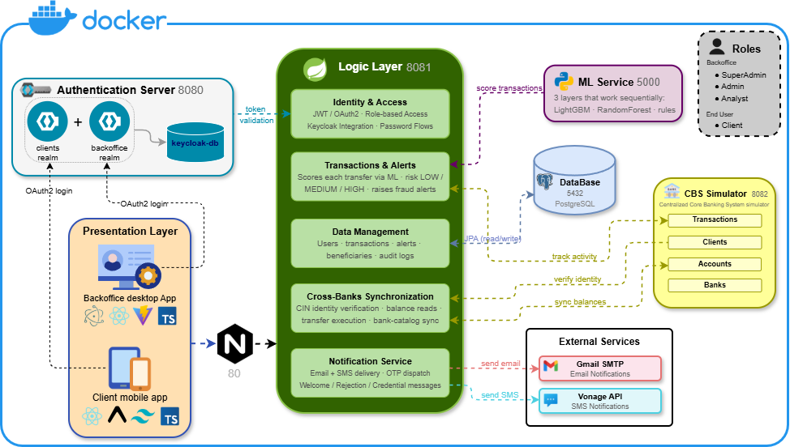
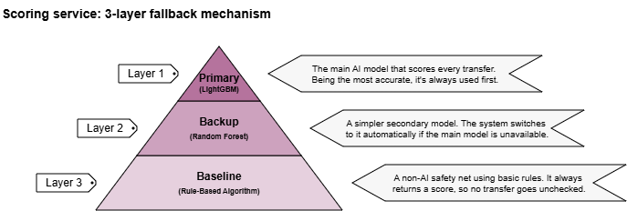
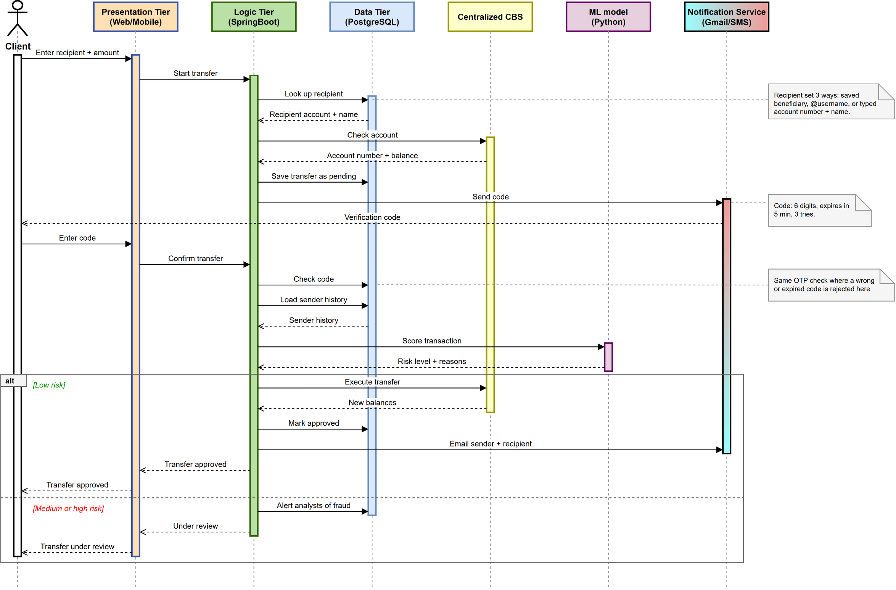
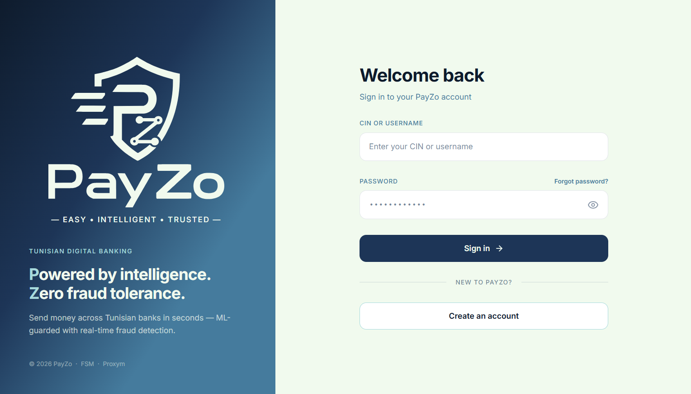
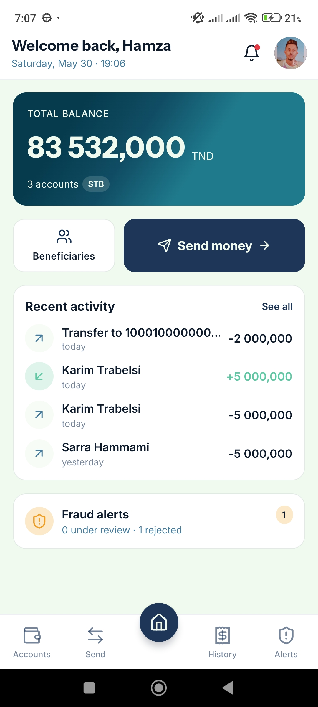
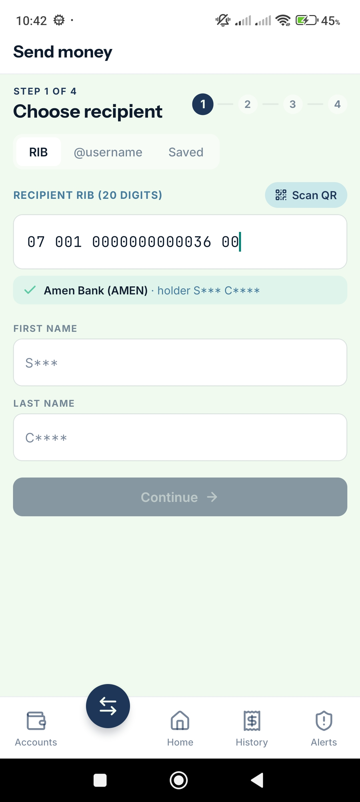
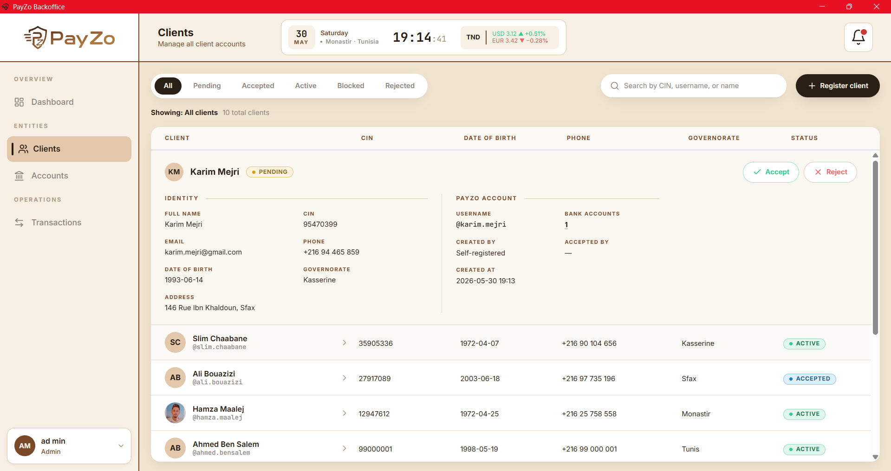
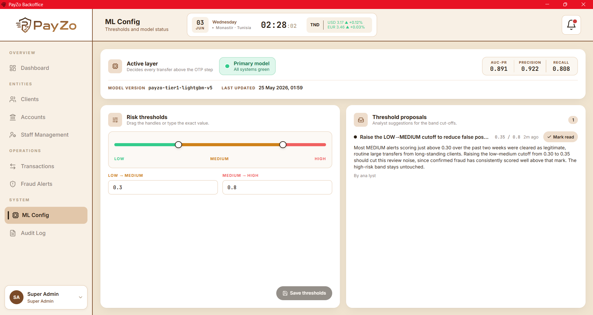

# PayZo

**Tunisian digital banking platform with real-time ML-based P2P fraud detection**


PFE project — Faculté des Sciences de Monastir 2025–2026
Student: **Mohamed Ben Salem** | Supervisor: **Mr. Mohsen Maraoui**

Report: [PayZo_Report.pdf](Documents/Report/PayZo_Report.pdf)

---

## Table of Contents

- [Overview](#overview)
- [System Architecture](#system-architecture)
- [Tech Stack](#tech-stack)
- [Repository Layout](#repository-layout)
- [Fraud Detection](#fraud-detection)
- [Transfer Pipeline](#transfer-pipeline)
- [Getting Started](#getting-started)
- [Service URLs and Credentials](#service-urls-and-credentials)
- [Demo Data](#demo-data)
- [API Conventions](#api-conventions)
- [Screenshots](#screenshots)
- [Testing](#testing)
- [Project Status](#project-status)

---

## Overview

Tunisian retail banking is fragmented: clients hold accounts across multiple banks, manage them through incompatible apps, and have no unified view of their finances. PayZo consolidates multi-bank access behind a single platform — client web app, mobile app (Expo), and a backoffice desktop app for operations staff.

The critical differentiator is the fraud layer. Every P2P transfer is scored in real time by a trained LightGBM model before money moves. Medium- and high-risk transfers are suspended for analyst review instead of executing automatically. The scoring tier degrades gracefully through a three-layer fallback so the pipeline never blocks on ML availability.

---

## System Architecture



Seven containers run under Docker Compose on a single bridge network (`payzo-net`):

| Container | Role |
|---|---|
| `backend` | Spring Boot API (port 8081) — auth, transfers, fraud alerts, notifications |
| `keycloak` | Identity provider (port 8080) — two realms: `clients` (end users) and `backoffice` (staff) |
| `postgres-db` | Single PostgreSQL 16 instance hosting three databases: `payzo_db`, `keycloak_db`, `cbs_db` |
| `cbs-simulator` | Core Banking Simulator (port 8082) — Tunisian ledger with 50 seeded clients, 7 banks |
| `ml-service` | FastAPI inference service (port 5000) — 3-tier LightGBM scorer |
| `client-web-app` | React SPA Vite dev server (port 5173) |
| `nginx` | Reverse proxy (port 80) — routes `/api/` to backend, `/` to client SPA |

The **backoffice** (BO-Web-App) and **mobile** (Client-Mobile-App) apps run outside Docker. The backoffice ships as an Electron desktop app; the mobile app uses Expo.

The backend reads the CBS database directly via a second JPA datasource (`cbs_db`) — no REST hop for balance checks and account lookups during the transfer pipeline. The CBS REST API remains available for debugging.

---

## Tech Stack

### Backend

| Concern | Choice |
|---|---|
| Runtime | Java 17, Spring Boot 3.2 |
| Security | Spring Security + OAuth2 Resource Server (JWT), Keycloak 24 |
| Data | Spring Data JPA + Hibernate, PostgreSQL 16 |
| Async HTTP | Spring WebFlux WebClient (CBS + ML calls) |
| Mapping | MapStruct (compile-time, no reflection) |
| Cache | Caffeine (BlockedUserFilter 30 s TTL) |
| Email | Spring Boot Mail (Gmail SMTP) |
| SMS | Vonage SDK |
| Docs | Springdoc OpenAPI 3 (Swagger UI) |

### ML Service

| Concern | Choice |
|---|---|
| Runtime | Python 3.11, FastAPI |
| Tier 1 model | LightGBM (`payzo-tier1-lightgbm-v5`) |
| Tier 2 model | Random Forest (`payzo-random_forest-v5`) |
| Tier 3 | Rule firewall (hard-coded heuristics) |
| Calibration | Isotonic regression |
| Explainability | SHAP (TreeSHAP for LightGBM) |

### Frontends

| App | Stack |
|---|---|
| Client Web | React 19, Vite, TypeScript, Tailwind CSS v4, Keycloak-js |
| Backoffice | React 19, Vite, TypeScript, Tailwind CSS v4, Electron |
| Mobile | React Native (Expo), TypeScript |

### Infrastructure

| Concern | Choice |
|---|---|
| Auth / SSO | Keycloak 24 (two realms, PKCE + ROPC flows) |
| Database | PostgreSQL 16 (three schemas in one instance) |
| Proxy | Nginx (reverse proxy + CSP headers) |
| Containers | Docker + Docker Compose |

---

## Repository Layout

```
PayZo/
├── Backend/                 Spring Boot 3.2 API — auth, transfers, fraud, notifications
├── CBS-Simulator/           Core Banking Simulator — Tunisian ledger, seeded with real RIBs
├── ML-Service/              FastAPI fraud scorer — training pipeline + 3-tier inference API
├── BO-Web-App/              React + Electron backoffice desktop app (admins, analysts, SA)
├── Client-Web-App/          React client SPA (dashboard, send money, beneficiaries, alerts)
├── Client-Mobile-App/       Expo React Native app (same feature set as the web client)
├── Keycloak/realms/         Realm JSON imports (clients-realm.json, backoffice-realm.json)
├── Postgres-DB/             init.sh — bootstraps keycloak_db and cbs_db inside postgres-db
├── NGINX/                   nginx.conf — reverse proxy and CSP
├── Documents/Report/        PFE report (LaTeX source + compiled PDF)
├── docker-compose.yml
├── docker-compose.override.yml   Remote debug (5005) + .m2 volume mount for dev
├── .env.example
└── bootstrap-superadmin.sh  One-shot Keycloak + SuperAdmin setup script
```

---

## Fraud Detection



Every confirmed P2P transfer is scored before execution. The scoring pipeline has three tiers, each serving as a fallback for the one above it:

1. **Tier 1 — LightGBM** (`payzo-tier1-lightgbm-v5`): gradient boosting model trained on 377 k synthetic transactions. Scored against a held-out validation set and a separate test set.
2. **Tier 2 — Random Forest** (`payzo-random_forest-v5`): bagging fallback, activated when Tier 1 is unavailable.
3. **Tier 3 — Rule firewall**: deterministic heuristics (velocity, amount thresholds, new-account flags). Always available.

**Model performance (test set):**

| Metric | Tier 1 (LightGBM) | Tier 2 (Random Forest) |
|---|---|---|
| PR-AUC | 0.900 | 0.883 |
| ROC-AUC | 0.992 | 0.993 |
| F1 | 0.876 | 0.843 |
| Precision | 0.936 | 0.867 |
| Recall | 0.823 | 0.819 |

**Feature set (24 features):** transaction amount and balance ratios, geographic distance between sender and receiver governorates, sender velocity (24 h count, amount, distinct destinations), sender account age, trust score, beneficiary familiarity, per-user norm features (30-day z-score, hour likelihood, velocity relative to personal baseline), and account type.

**Risk thresholds:** LOW < 0.30 ≤ MEDIUM < 0.70 ≤ HIGH (adjustable by SuperAdmin at runtime).

**Risk routing:**
- LOW: execute in CBS immediately, notify sender and receiver.
- MEDIUM / HIGH: suspend transaction, create a FraudAlert for analyst review.

**Backend-side fallback:** the Spring service (`MlIntegrationService`) independently implements the same three-layer fallback. When a layer transition occurs, `ml_model_config.active_layer` is updated and in-app notifications are fanned out to all analysts and the SuperAdmin.

---

## Transfer Pipeline



The 10-step pipeline in execution order:

1. Resolve recipient — one of: saved beneficiary (RIB pre-verified), PayZo `@username` (identity proven by username), or manual RIB + first/last name entry.
2. Validate source and destination RIBs (mod-97 check).
3. Reject self-transfer.
4. Confirm no concurrent in-progress transfer exists for this client (DB-level partial unique index + application guard).
5. Assert sender account is ACTIVE.
6. Confirm source and destination banks are active in PayZo.
7. Server-side name re-verification against CBS (manual path only; skipped for saved beneficiaries and `@username`).
8. Check CBS balance >= amount.
9. Snapshot balances, persist `Transaction(PENDING_OTP)`.
10. Generate and dispatch OTP (email or SMS, chosen by the sender at login).

**On OTP confirmation:** score via ML pipeline. LOW → execute transfer in CBS, mark `APPROVED`, notify both parties. MEDIUM / HIGH → mark `SUSPENDED_PENDING_ANALYST`, create `FraudAlert`, notify analysts.

**Between-account transfers** (same client, different accounts): no OTP, no ML scoring, executed directly in CBS.

---

## Getting Started

### Prerequisites

- Docker Desktop (with at least 4 GB RAM allocated)
- Python (for `bootstrap-superadmin.sh` JSON parsing)
- `curl`

### 1. Clone and configure

```bash
git clone https://github.com/Mohamedbs456/PayZo.git
cd PayZo
cp .env.example .env
```

The development defaults in `.env.example` work out of the box for a local run. Edit `.env` only if you need to use real email or SMS credentials.

### 2. Start the stack

```bash
docker compose up -d --build
```

This starts all seven services. The backend waits for Keycloak and CBS to be healthy before it starts. On first run, allow 2–3 minutes for Keycloak to initialize and import the realm JSON files.

You can watch readiness with:

```bash
docker compose ps
```

### 3. Bootstrap Keycloak and the SuperAdmin

On a fresh stack (or after `docker compose down -v`), run the one-shot bootstrap script:

```bash
./bootstrap-superadmin.sh
```

This script:
- Grants the backend service accounts the `realm-management` roles they need to create and manage users in Keycloak.
- Creates a `SUPERADMIN` user in the `backoffice` realm with the role assigned.
- Enables `fullScopeAllowed` on the frontend Keycloak client so realm roles appear in JWTs.
- Restarts the backend so `DataInitializer` mirrors the SuperAdmin into the local database.

The script is idempotent — safe to re-run.

### 4. Run the backoffice desktop app

The backoffice is a React + Electron app that runs on your host, not in Docker.

```bash
cd BO-Web-App
npm install
npm run dev        # Vite dev server on port 5174
```

To launch the Electron wrapper:

```bash
npm run electron   # opens the desktop window
```

### 5. Run the mobile app

```bash
cd Client-Mobile-App
npm install
npx expo start     # scan the QR with Expo Go, or press 'w' for browser
```

---

## Service URLs and Credentials

| Service | URL |
|---|---|
| Client Web App | http://localhost:5173 |
| Backoffice (dev server) | http://localhost:5174 |
| Spring Boot API | http://localhost:8081 |
| Swagger UI | http://localhost:8081/swagger-ui.html |
| Keycloak Admin Console | http://localhost:8080 |
| CBS Simulator | http://localhost:8082/cbs/api/v1/health |
| ML Service | http://localhost:5000/ml/api/v1/health |
| Nginx proxy | http://localhost:80 |
| PostgreSQL | localhost:5432 |

**Default credentials (development only):**

| Account | Username | Password |
|---|---|---|
| Keycloak admin console | `admin` | `admin` |
| PayZo SuperAdmin (backoffice) | `superadmin` | `Superadmin123!` |

---

## Demo Data

The CBS Simulator seeds the following on first startup (deterministic, seed 42):

- **7 Tunisian banks** with official 2-digit numeric codes (STB-10, ATB-04, BIAT-08, ZTB-25, AMEN-07, BTE-11, UIB-12)
- **50 clients** with authentic Tunisian names, 24-governorate coverage, and real +216 phone numbers
- **~110 accounts** with 20-digit mod-97 Tunisian RIBs
- **~1600 pre-existing transactions** spread across the accounts

The backend `DemoSeedService` additionally creates three deterministic sender profiles (student, business, coffee shop), three saved recipients, and a 30-day APPROVED transaction backlog for jury demonstration.

To find a seeded CIN, check the CBS Simulator startup logs:

```bash
docker compose logs cbs-simulator | grep "sample CINs"
```

---

## API Conventions

All backend endpoints are under `/api/v1`.

**Response envelope:**

```json
{
  "success": true,
  "message": "...",
  "data": { }
}
```

**Error envelope:**

```json
{
  "success": false,
  "message": "...",
  "errorCode": "INVALID_RIB",
  "data": null
}
```

**Paginated lists** use `?page=0&size=20` (max 100, clamped silently):

```json
{
  "content": [ ],
  "page": 0,
  "size": 20,
  "totalElements": 150,
  "totalPages": 8
}
```

Full API documentation is available at [Swagger UI](http://localhost:8081/swagger-ui.html) when the stack is running.

---

## Screenshots

**Client web app**



**Mobile app — dashboard and send money**

| Dashboard | Send Money |
|---|---|
|  |  |

**Backoffice — client management and ML configuration**

| Client Management | ML Configuration |
|---|---|
|  |  |

---

## Testing

**Backend unit tests (27):**

```bash
cd Backend
./mvnw test
```

Covers: `TransferService`, `FraudDetectionService`, `MlIntegrationService`, `OtpService`, `RegistrationService`, `AlertService`, `BankSyncService`, `TrustScoreService`, `BeneficiaryService`, `CbsIntegrationService`, `TransferAssistService`, `ClientProfileService`, `TransactionService`, `PasswordResetService`, and utility classes (`RibValidator`, `NameMatcher`, `PasswordPolicy`, `UsernameGenerator`, `TrustBands`, `NotificationCursor`).

**ML service tests:**

```bash
cd ML-Service
pytest tests/
```

---

## Project Status

| Area | Status |
|---|---|
| Backend API (auth, transfers, fraud, notifications, dashboards) | Complete |
| Keycloak dual-realm auth (clients + backoffice) | Complete |
| Transfer pipeline (10 steps, OTP gating, ML scoring) | Complete |
| ML fraud detection (training, 3-tier inference, SHAP explainability) | Complete |
| CBS Simulator (PostgreSQL, 20-digit RIBs, 50 seeded clients) | Complete |
| Client Web App | Complete |
| Backoffice desktop app (Electron) | Complete |
| Mobile app (Expo) | Complete |
| PFE report | Complete |
| README | Complete |

---

## Author

**Mohamed Ben Salem**
Faculté des Sciences de Monastir — Licence en Sciences Informatiques
PFE 2025–2026

Supervisor: **Mr. Mohsen Maraoui**
